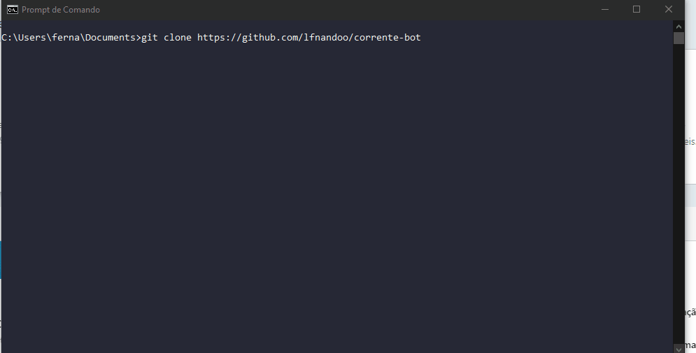

<h1 align="center">
    
</h1>
<h4 align="center">
  🤖 Corrente do Bem Bot 🤖
</h4>
<h4 align="center">
 🔥 <a href="#-demo">Demo</a>&nbsp;&nbsp;&nbsp;|&nbsp;&nbsp;&nbsp;
</h4>

<p align="center">
  <a href="#rocket-technologies">Technologies</a>&nbsp;&nbsp;&nbsp;|&nbsp;&nbsp;&nbsp;
  <a href="#-run">Run</a>&nbsp;&nbsp;&nbsp;|&nbsp;&nbsp;&nbsp;
  <a href="#-project">Project info</a>&nbsp;&nbsp;&nbsp;|&nbsp;&nbsp;&nbsp;
</p>

<br>

## :rocket: Technologies

Project made with:

- Puppeteer
- Prompt-Sync
- PDFKit
- Fs
- Colors

## 🔥 Demo



## 📌 Run

For run this project you nedded Git, Node.js and Npm =)
```bash
## Clone repository
$ git clone https://github.com/lfnandoo/corrente-bot

## Enter in repository
$ cd corrente-bot

## Install dependences
$ npm install

## Start script
$ node index.js

## Wait some seconds.
```

## 💻 Project

I got inspired [this](https://www.linkedin.com/in/igor-rebolla/detail/recent-activity/shares), 
I had an idea that it was to make more people able to contribute and make the activity productive.
Open issues and pull-requests for improve this project and report any bug.

Made with 💜 by Luiz Fernando :wave: [Linkedin](https://www.linkedin.com/in/luizfernandoo/)
